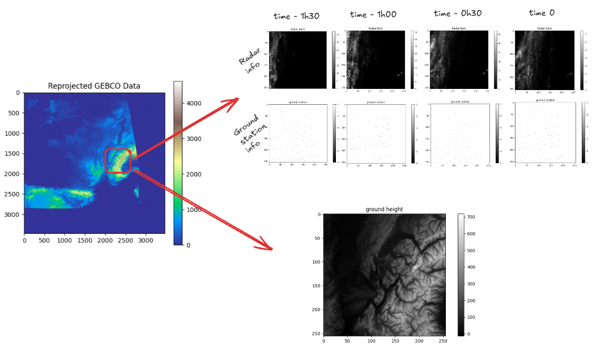

This dataset was created thanks to meteofrance open data initiatives.


This information has to be provided according to https://portail-api.meteofrance.fr/web/fr/cpu.

# meteolibre_dataset

This repository is dedicated to the preprocessing of Météo-France (MF) data and ground station data to create a unified dataset suitable for training machine learning models.

The primary goal is to take raw data from Météo-France and ground stations, apply necessary preprocessing steps, and fuse them into a single, ready-to-use (huggingface) dataset.

One can freely donwload the different version of the dataset :

gs://meteofrance-preprocess/hf_dataset_v4.zip

## Features

- Download scripts for raw Météo-France and ground station data.
- Preprocessing pipelines for both data sources.
- Data fusion mechanism to combine different data types.

## Setup

To set up the project, you can either use the provided Dockerfile or install dependencies manually.

### Using Docker

Build the Docker image:
```bash
docker build -t meteolibre_dataset .
```

Run the container:
```bash
docker run -it meteolibre_dataset /bin/bash
```

Inside the container, run:
```bash
bash init.sh
# Activate the Python virtual environment
source venv/bin/activate
cd scripts
bash download_all.sh
```  
*(This will download and preprocess both Météo-France and ground station data.)*

### Manual Installation

Clone the repository and prepare the environment:
```bash
git clone https://github.com/your_username/meteolibre_dataset.git
cd meteolibre_dataset
bash init.sh
# Activate the Python virtual environment
source venv/bin/activate
```

See the **Getting Started** section below for the full pipeline execution.

## Data

The dataset is built from two main sources:

1.  **Météo-France (MF) Data:** Raw meteorological data provided by Météo-France.
2.  **Ground Station Data:** Data collected from various ground weather stations.

The preprocessing steps involve cleaning, transforming, and aligning data from both sources before fusion.

You can access the preprocess dataset here :

gs://meteofrance-preprocess/hf_dataset_v4.zip

or here : 

https://huggingface.co/datasets/Forbu14/meteolibre_france

The global idea is here : 

The core of this project is to create a rich dataset for weather forecasting. We start with raw data from Météo-France's radar network and supplement it with readings from ground stations. The primary challenge is to transform this heterogeneous data into a format suitable for deep learning models. Our process involves several key steps: first, we align the data from different sources by timestamp. Then, we project the ground station data onto a 2D grid, creating image-like representations. Finally, we extract time series of 256x256 pixel image patches from both the radar and ground station data. These patches are centered over areas of interest and represent a sequence of weather conditions, which will be used to train a model to predict future weather patterns.




## Getting Started

This section guides you through setting up the environment, downloading data, preprocessing, and generating the final Hugging Face dataset.

### 1. Setup & Installation

Clone the repository and initialize the environment:
```bash
git clone https://github.com/your_username/meteolibre_dataset.git
cd meteolibre_dataset
bash init.sh
# Activate the Python virtual environment
source venv/bin/activate
```

### 2. Download Raw Data

Run the main download script to fetch Météo-France HDF5 files and ground station data:
```bash
cd scripts
bash download_all.sh
```

### 3. Preprocess Ground Station Data

Filter, transform, and project the raw ground station Parquet files:
```bash
python preprocess_groundstations.py
```

### 4. Create NPZ Files for Ground Stations

Convert filtered station data into 2D image-like NPZ files:
```bash
python groundstation_npz_writing.py
```

### 5. Create File Index

Synchronize radar (.h5) and station (.npz) files by timestamp:
```bash
python index_creation.py
```

### 6. Generate Hugging Face Dataset

Resize data, assemble temporal sequences, and build the HF dataset:
```bash
bash hf_generation.sh
```
This will produce a `hf_dataset/` folder under `data/`.

### 7. (Optional) Visualize the Dataset

Use the visualization script to inspect samples:
```bash
python hf_dataset_visualization.py
```

### 8. Download the dataset

```python
from datasets import load_from_disk
dataset = load_from_disk("data/hf_dataset")
print(dataset)
```

## Project Structure

```
.
├── Dockerfile
├── init.sh
├── LICENSE
├── README.md
├── requirements.txt
├── reprojected_gebco_32630_500m_padded.png
├── data/                         # Raw and processed data
│   ├── datagouv/                 # Data.gouv station metadata
│   ├── groundstations/           # Raw station CSVs
│   ├── groundstations_parquet/   # Unpacked Parquet versions
│   ├── groundstations_filter/    # Filtered & transformed station data
│   ├── groundstation_npz/        # NPZ images of station data
│   ├── h5/                        # Météo-France HDF5 files
│   └── hf_dataset/               # Final Hugging Face dataset output
├── meteolibre_dataset/           # BUFR preprocessing module
├── scripts/                      # Pipeline scripts
│   ├── download_all.sh           # Full download & preprocess pipeline
│   ├── get_bucket_list_files.py  # List MF files in GCS bucket
│   ├── download_h5_files.py      # Download HDF5 from GCS
│   ├── download_groundstation.py # Fetch station CSVs from data.gouv
│   ├── preprocess_groundstations.py
│   ├── groundstation_npz_writing.py
│   ├── index_creation.py         # Synchronize radar & station timestamps
│   ├── hf_generation.sh          # Generate & push HF dataset
│   ├── hf_dataset_resize.py      # Resize & pack HF dataset
│   └── hf_dataset_visualization.py
└── tables/                       # BUFR descriptor lookup tables
``` 

## Contributing

Contributions, feedback, and issues are welcome! Please open an issue or submit a pull request on GitHub.

## Citation

TODO BE WRITE IN THE NEAR FUTURE
If you use this pipeline or dataset in your research, please cite:

```
Adrien Bufort et al., "meteolibre_dataset: A fused Météo-France and ground station weather dataset", 2025.
```

## License

This project is licensed under the terms of the [LICENSE](LICENSE) file. (Apache 2.0)
and also https://portail-api.meteofrance.fr/web/fr/cpu